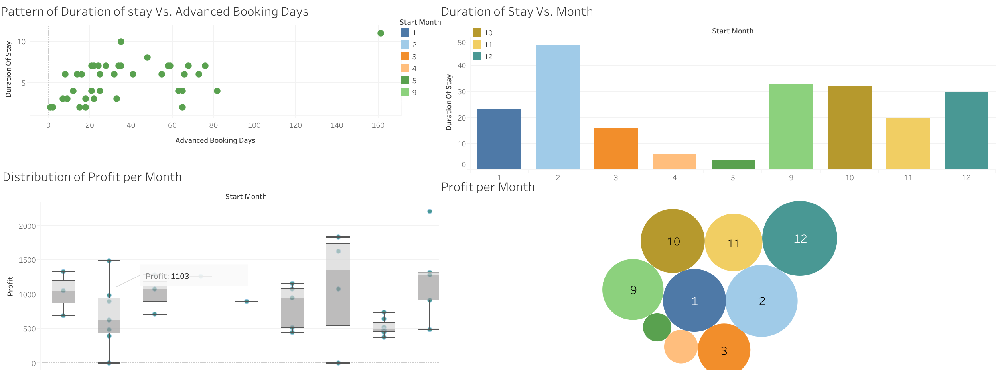

# Objectives
To provide an data analytic view for the current (2021-2022) Airbnb vacation rental business. This analysis is carried out in order to visualize the pattern of guest bookings, room demand patterns and to increase the profit. From these insights, we try to derive new marketing and business strategies to improve the quality of service and customer satisfaction.

## Analysis Platforms
1. R for data cleaning 
2. Tableau for visualization (https://public.tableau.com/app/profile/joe.chun#!/)

## Data and cleaning 

The data of our Airbnb vacation rental is obtained from https://www.airbnb.co.kr/hosting/reservations/all and the data up to March 2022  is uploaded in this repository. Please contact me if you cannot download the data.

We did the following data cleaning
- After loading the data we cleaned the data formats to confirm with the POSIXlt format.
- We extracted then the duration of stay, number of months of prior booking  and number of days of advanced booking.
 

# Analytics questions
We ask the following questions
1. What is the pattern of booking as function of months of a year?
2. What is the relationship between the duration of stay and the days of prior booking?
3. What would be the average profit per month?

## Findings 

From the data, we observed the following for the years 2021 and 2022.

1. In Honolulu, people prefer to spend more time in the winter than in the summer and that tell us to prepare better for the flux of customers during winter season.
2. Interestingly, we predicted that people who stay longer booked the the rooms earlier. The correlation between the two variables is more than 0.52

## **Figure. The Tableau Dashboard of the finding from the data **
 
